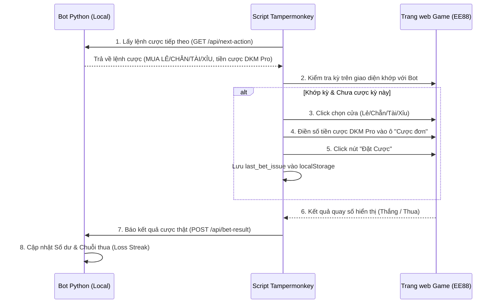

# KẾ HOẠCH TRIỂN KHAI DỰ ÁN (CÁC HẠNG MỤC CHƯA THỰC HIỆN)

Tài liệu này lưu trữ danh sách các công việc **chưa thực hiện** của dự án. Tất cả các tính năng đã hoàn thành (Bộ tham số dự đoán, Chiến thuật DKM Pro Engine, API Bot /api/next-action & /api/bet-result) đã được nghiệm thu và dọn dẹp khỏi file này.

---

## 1. Script Tampermonkey Tự Động Đặt Cược (Auto-Bet trên trình duyệt)

### 1.1 Sơ đồ hoạt động (Flow)

### 1.2 Các bước triển khai Script Tampermonkey
1. **Bắt DOM & Thao tác tự động trên Game**:
   * **Nút chọn cửa**: Thẻ chứa chữ "Lẻ", "Chẵn", "Tài", "Xỉu" trong phần "Kèo đôi".
     * *XPath dự kiến*: `//div[contains(text(), 'Kèo đôi')]/..//span[contains(text(), 'Lẻ')]`
   * **Ô nhập tiền cược**: Ô Input kế bên nhãn "Cược đơn:".
   * **Nút đặt cược**: Nút màu xanh ở góc phải chứa chữ "Đặt Cược".
2. **Cơ chế chống cược lặp (Double Bet Prevention)**:
   * Script lưu trạng thái `last_bet_issue` vào `localStorage` của trình duyệt. Chỉ đặt cược nếu `Kỳ trên game == Kỳ dự đoán` và `Kỳ dự đoán != last_bet_issue`.

### 1.3 Quy trình kiểm thử & Nghiệm thu
1. **Chế độ Dry-Run (Hiển thị)**: Script chỉ tự động Click chọn cửa và điền số tiền, nhưng **KHÔNG** click nút "Đặt cược" để kiểm tra tính chính xác.
2. **Chế độ Chạy thật (Real-Run)**: Tự động Click nút "Đặt cược" và gửi kết quả về API `/api/bet-result`.
