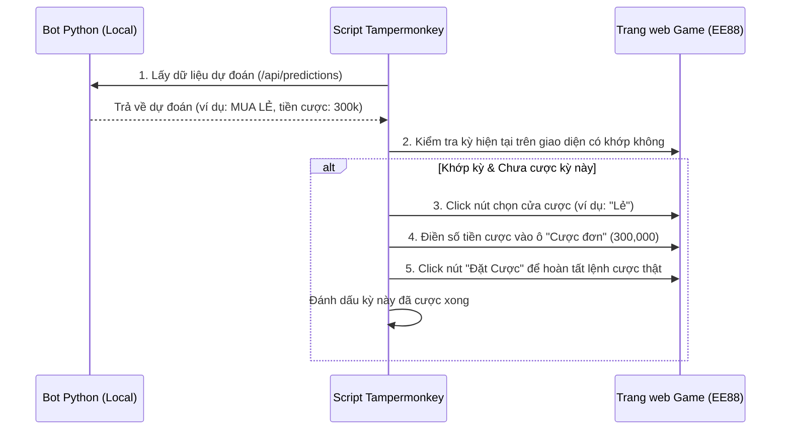

# Kế hoạch triển khai - Tự động đặt cược (Auto-Bet) bằng Tampermonkey

Chúng tôi đề xuất cơ chế đặt cược tự động an toàn thông qua Script Tampermonkey chạy trực tiếp trên trình duyệt của người dùng. Script sẽ giả lập hành vi click của con người để đặt cược dựa trên dự đoán từ Bot local.

---

## Nguyên lý hoạt động (Flow)



---

## Các bước triển khai chi tiết

### Bước 1: Xây dựng Endpoint API hỗ trợ Auto-Bet trên Bot
* Tạo endpoint `GET /api/next-action` trả về thông tin cược sẵn sàng cho kỳ tiếp theo:
  ```json
  {
    "status": "success",
    "issue": "202607080432",
    "parity": { "decision": "MUA LẺ", "amount": 300000 },
    "size": { "decision": "BỎ QUA", "amount": 0 }
  }
  ```

### Bước 2: Tích hợp logic tìm nút và đặt cược vào Script Tampermonkey
Script sẽ tìm các phần tử HTML trên trang game theo cấu trúc mẫu:
1. **Nút chọn cửa:**
   - Tìm các thẻ chứa chữ "Lẻ", "Chẵn", "Tài", "Xỉu" trong phần "Kèo đôi".
   - Ví dụ Selector dự kiến: `//div[contains(text(), 'Kèo đôi')]/..//span[contains(text(), 'Lẻ')]` (dùng XPath hoặc ClassName cụ thể).
2. **Ô nhập tiền cược:**
   - Tìm ô Input kế bên nhãn "Cược đơn:".
3. **Nút đặt cược:**
   - Tìm nút màu xanh ở góc phải chứa chữ "Đặt Cược".

### Bước 3: Cơ chế chống cược lặp (Double Bet Prevention)
* Script lưu trạng thái `last_bet_issue = "202607080432"` vào `localStorage` của trình duyệt.
* Chỉ đặt cược nếu `Kỳ tiếp theo trên game == Kỳ dự đoán` và `Kỳ dự đoán != last_bet_issue`.

---

## Nghiệm thu & Kiểm thử an toàn
1. **Chạy thử nghiệm ở chế độ hiển thị (Dry-Run):** Script chỉ tự động Click chọn cửa và điền số tiền, nhưng **KHÔNG** click nút "Đặt cược" để anh kiểm tra xem script đã click và điền đúng tiền cược chưa.
2. **Chạy thật:** Sau khi anh xác nhận Dry-run chuẩn xác, kích hoạt tự động Click nút "Đặt cược".
