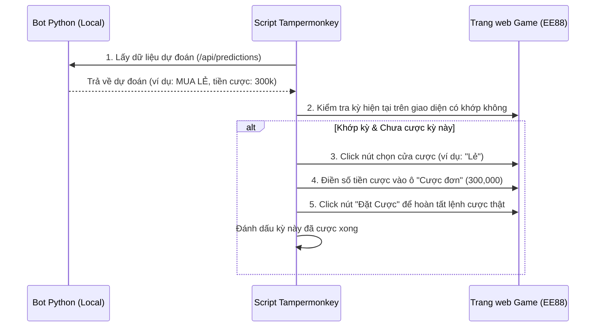

# KẾ HOẠCH TRIỂN KHAI TỔNG HỢP (HỆ THỐNG AUTO-BET & CÁC TÍNH NĂNG CHƯA HOÀN THÀNH)

Tài liệu này là nơi lưu trữ **duy nhất** toàn bộ kế hoạch, đặc tả kỹ thuật và danh sách các công việc chưa thực hiện của dự án. Tất cả các ghi chú cũ từ `notes.md`, `plan-update.md` và `trung_nhau.md` đã được hợp nhất tại đây để tránh trùng lặp.

---

## 1. Tự động đặt cược (Auto-Bet) bằng Tampermonkey
* **Mô tả:** Triển khai script Tampermonkey chạy trên trình duyệt của người dùng để giả lập hành vi click đặt cược thật dựa trên phân tích từ Bot local.

### 1.1 Sơ đồ hoạt động (Flow)


### 1.2 Các bước triển khai chi tiết
* **Bước 1: Xây dựng Endpoint API hỗ trợ Auto-Bet trên Bot**
  Tạo endpoint `GET /api/next-action` trả về thông tin cược sẵn sàng cho kỳ tiếp theo:
  ```json
  {
    "status": "success",
    "issue": "202607080432",
    "parity": { "decision": "MUA LẺ", "amount": 300000 },
    "size": { "decision": "BỎ QUA", "amount": 0 }
  }
  ```
* **Bước 2: Tích hợp logic tìm nút và đặt cược vào Script Tampermonkey**
  Script sẽ tìm các phần tử HTML trên trang game theo cấu trúc mẫu:
  1. **Nút chọn cửa:** Tìm các thẻ chứa chữ "Lẻ", "Chẵn", "Tài", "Xỉu" trong phần "Kèo đôi".
     * *Selector dự kiến:* `//div[contains(text(), 'Kèo đôi')]/..//span[contains(text(), 'Lẻ')]` (dùng XPath hoặc ClassName cụ thể).
  2. **Ô nhập tiền cược:** Tìm ô Input kế bên nhãn "Cược đơn:".
  3. **Nút đặt cược:** Tìm nút màu xanh ở góc phải chứa chữ "Đặt Cược".
* **Bước 3: Cơ chế chống cược lặp (Double Bet Prevention)**
  Script lưu trạng thái `last_bet_issue = "202607080432"` vào `localStorage` của trình duyệt. Chỉ đặt cược nếu `Kỳ tiếp theo trên game == Kỳ dự đoán` và `Kỳ dự đoán != last_bet_issue`.

### 1.3 Quy trình nghiệm thu & Kiểm thử an toàn
1. **Chạy thử nghiệm ở chế độ hiển thị (Dry-Run):** Script chỉ tự động Click chọn cửa và điền số tiền, nhưng **KHÔNG** click nút "Đặt cược" để người dùng kiểm tra xem script đã click và điền đúng tiền cược chưa.
2. **Chạy thật:** Sau khi người dùng xác nhận Dry-run chuẩn xác, kích hoạt tự động Click nút "Đặt cược".

---

## 2. Quản lý vốn và Chiến thuật theo thời gian (Money Management & Time Strategy)

### 2.1 Cấu hình khung giờ chạy Bot (Time-based Restrictions)
Tự động điều chỉnh mức độ tự tin (Confidence Level) và tiền cược dựa trên thời gian thực tế:
* **Khung giờ thuận lợi (Có lợi/Ưu tiên cược):**
  * `10:00 - 12:00` (Trưa)
  * `15:00 - 16:00` (3h - 4h chiều)
* **Khung giờ bất lợi (Rủi ro/Hạn chế hoặc tạm dừng cược):**
  * `19:30 - 21:00` (7h30 - 9h tối)


